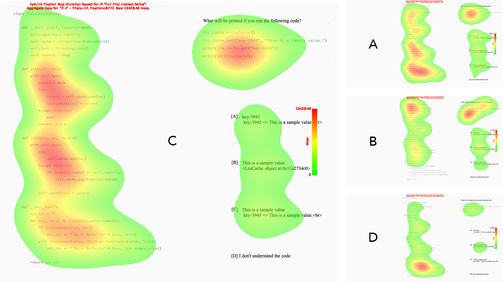

# Predicting Code Comprehension Using Eye-Tracking

This repository contains scripts and data of Tarek Alakmeh's Bachelor's Thesis "Predicting Code Comprehension Using Eye-Tracking" (2022, HASEL, University of Zurich).

Figure: Example of aggregated fixation hotspots across participants. C depicts the correct task outcome (i.e. code comprehension).

## Overview
- Code Snippets
  - [Source Code with Tasks](https://github.com/Taremeh/predicting-code-comprehension-using-eye-tracking-thesis/tree/main/code-snippets)
  - [Images (light)](https://github.com/Taremeh/predicting-code-comprehension-using-eye-tracking-thesis/tree/main/code-snippets/images-light)
- Eye-Tracking Data
  - [Raw Fixation Reports](https://github.com/Taremeh/predicting-code-comprehension-using-eye-tracking-thesis/tree/main/data/raw-data)
  - [Processed Data](https://github.com/Taremeh/predicting-code-comprehension-using-eye-tracking-thesis/tree/main/data/processed-data)
- Scripts
  - [Data Pre-Processing Script](https://github.com/Taremeh/predicting-code-comprehension-using-eye-tracking-thesis/blob/main/scripts/preprocess_data.ipynb)
  - [Neural Network](https://github.com/Taremeh/predicting-code-comprehension-using-eye-tracking-thesis/blob/main/scripts/neural-network-cross-validation.py)
  - [Source Code Image Generation](https://github.com/Taremeh/predicting-code-comprehension-using-eye-tracking-thesis/blob/main/scripts/generate-code-images.ipynb)
